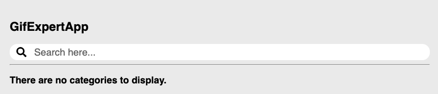
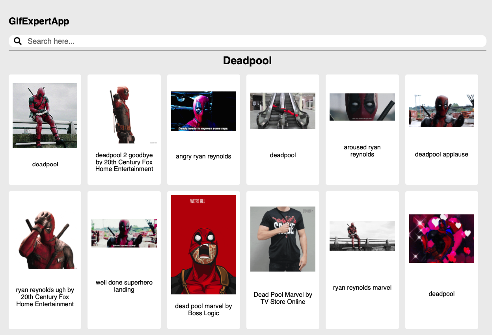

# Gif Expert App

- [Developers Giphy][giphy]
- [Animate CSS][animate_css]

- [Estructura de archivos][structure]
- [Structuring projects and naming components in React][structuring-projects-and-naming-components]

- [Jest][jestjs]
- [Enzyme][enzyme]
- [Enzyme to json][enzyme_to_json]
- [React Hooks Testing Library][react_hooks_testing]

[giphy]: https://developers.giphy.com/
[animate_css]: https://animate.style/

[structure]: https://es.reactjs.org/docs/faq-structure.html
[structuring-projects-and-naming-components]: https://hackernoon.com/structuring-projects-and-naming-components-in-react-1261b6e18d76

[jestjs]: https://jestjs.io/docs/en/expect
[enzyme]: https://enzymejs.github.io/enzyme/
[enzyme_to_json]: https://www.npmjs.com/package/enzyme-to-json
[react_hooks_testing]: https://react-hooks-testing-library.com/

### Screenshots

<p align="center">
  <kbd>
    
  </kbd>
</p>

<p align="center">
  <kbd>
    
  </kbd>
</p>

### Installs

With `package.json` and dependencies
> run `docker-compose run app yarn`

Without dependencies
```shell
docker-compose run app yarn add enzyme enzyme-adapter-react-16 enzyme-to-json --dev
docker-compose run app yarn add @testing-library/react-hooks --dev
docker-compose run app @fortawesome/fontawesome-svg-core @fortawesome/free-solid-svg-icons @fortawesome/react-fontawesome
```

### Project Structure

> run `tree -I "node_modules|public|build|docs"`
```shell
.
├── Dockerfile
├── README.md
├── docker-compose.yml
├── package.json
├── src
│   ├── GifExpertApp.js
│   ├── components
│   │   ├── AddCategory.js
│   │   ├── GifGrid.js
│   │   ├── GifGridItem.js
│   │   ├── ListCategories.js
│   │   └── index.js
│   ├── helpers
│   │   ├── getGifs.js
│   │   └── index.js
│   ├── hooks
│   │   ├── index.js
│   │   └── useFetchGifs.js
│   ├── index.css
│   ├── index.js
│   ├── setupTests.js
│   └── tests
│       ├── GifExpertApp.test.js
│       ├── __snapshots__
│       │   └── GifExpertApp.test.js.snap
│       ├── components
│       │   ├── AddCategory.test.js
│       │   ├── GifGrid.test.js
│       │   ├── GifGridItem.test.js
│       │   ├── ListCategories.test.js
│       │   └── __snapshots__
│       │       ├── AddCategory.test.js.snap
│       │       ├── GifGrid.test.js.snap
│       │       ├── GifGridItem.test.js.snap
│       │       └── ListCategories.test.js.snap
│       ├── helpers
│       │   └── getGifs.test.js
│       └── hooks
│           └── useFetchGifs.test.js
└── yarn.lock

10 directories, 30 files
```

### Scripts

#### Start

> run `docker-compose up`

#### Tests

> run `docker-compose run app yarn test`

#### Build

> run `docker-compose run app yarn build`, install `yarn global http-server` to test.
> run `http-server build`

### GitHub Pages

rename the `build` directory to `docs`, and rename the root paths `/` to `./` to search the some path.

